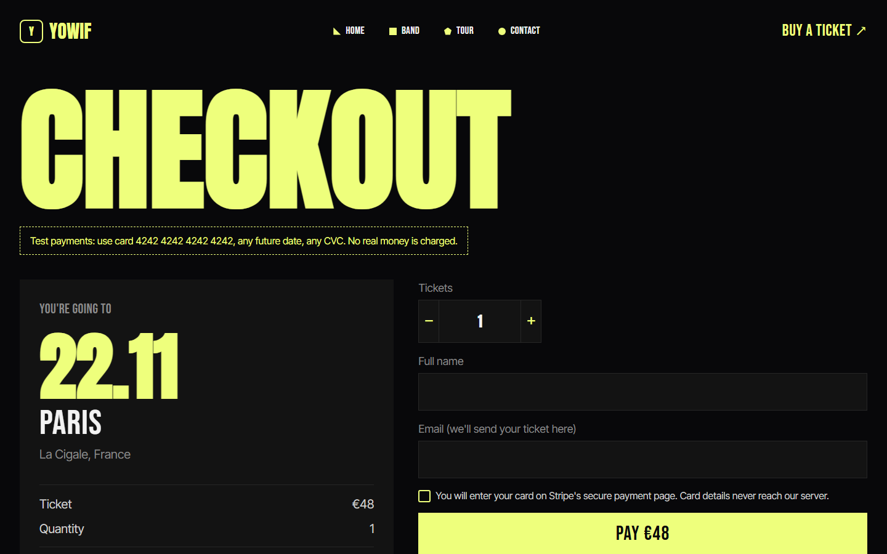
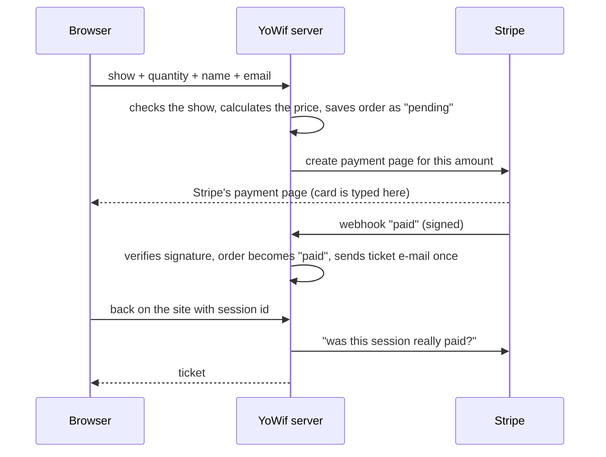

# YoWif — tour website with real ticket payments

A concert website for a (fictional) rock band: tour dates across Europe, ticket
purchase through **Stripe**, ticket e-mails, an admin panel and a PostgreSQL
database. Built as a portfolio case, deployed and handed over like a real
client project.

**Live demo:** https://yowif-site.onrender.com
Payments run in Stripe **test mode**, so you can buy a ticket with the card
`4242 4242 4242 4242`, any future date and any CVC. No real money is charged.

> The first visit may take a few seconds while the free server wakes up.

[Русская версия](README.ru.md)


| Tour dates | Checkout |
|---|---|
|  |  |

## Features

- **7 pages:** home, band, tour, contact, checkout, privacy policy, custom 404.
- **Ticket purchase:** pick a show and quantity → pay on Stripe's page → get a
  ticket on screen and by e-mail, with "add to calendar".
- **Admin panel** (password-protected): orders with payment status and revenue,
  contact messages, newsletter subscribers.
- **Contact form and newsletter** saved to the database.
- **Animations:** letters flying in, photo reveal, counters, scroll reveal,
  marquee. All of them turn off for users with "reduce motion".
- **Responsive** down to 320 px. Lighthouse (mobile): performance 92–96,
  accessibility, best practices and SEO 100.
- **Privacy policy** describing what the site really does with data (GDPR).
- **Health check** `/health` for uptime monitoring.

## How a payment works



## Security decisions

- **Card numbers never reach the server.** They are typed on Stripe's page;
  the site only stores "paid / not paid".
- **The server decides the price.** The browser only sends which show and how
  many tickets; a faked price in the request is ignored. Sold-out shows are
  refused before any payment.
- **Payment is confirmed only by Stripe:** signed webhooks are verified, and
  the return page asks Stripe directly. Forged or altered webhooks are rejected.
- **Exactly-once fulfilment:** "pending → paid" is a single atomic database
  update, so a repeated webhook never sends a second e-mail.
- **SQL injection:** values are always query parameters, table and column
  names come only from a whitelist in code.
- **No secrets in code.** Every key lives in the hosting settings. The server
  refuses to start with a missing or weak admin password.
- **Admin password** is compared in constant time.
- **Rate limiting** on the API, HTML escaping everywhere user data is shown.

## Tech stack

| Part | Technology |
|---|---|
| Front-end | HTML, CSS, vanilla JavaScript (no framework) |
| Back-end | Node.js 24, Express |
| Database | PostgreSQL (Supabase); JSON files for local development |
| Payments | Stripe Checkout + webhooks |
| E-mail | Resend |
| Hosting | Render |
| Monitoring | UptimeRobot → `/health` |
| Tests / CI | `node:test`, PGlite (Postgres in WebAssembly), GitHub Actions |

## Tests

```
npm test
```

24 tests: storage on a real PostgreSQL engine (PGlite, no database server
needed), all API routes, price tampering, sold-out and invalid orders, admin
authentication, Stripe webhook signatures (forged, wrong secret, altered body),
duplicate webhooks, simultaneous payment confirmations and upgrading an
older database without losing orders. GitHub Actions runs them on every push.

## Run locally

```
npm install
cp .env.example .env      # then set ADMIN_PASSWORD (10+ characters)
npm start
```

Open http://localhost:3000 (site) and http://localhost:3000/admin (admin).
Without a database URL the data is stored in `data/*.json`; without a Stripe
key the checkout runs in demo mode.

## Project structure

```
server.js          routes, validation, admin, start-up
lib/db.js          storage: PostgreSQL or JSON files, same interface
lib/payments.js    Stripe Checkout and webhook verification
lib/mail.js        ticket e-mail (HTML built for mail apps and dark mode)
public/            the website
admin/             admin panel
test/              automated tests
HANDOVER.md        handover document for the client (in Russian)
```

## Handover

The project was delivered as for a real client: every account (GitHub
organization, hosting, database, Stripe, e-mail, monitoring) belongs to the
client, and the developer only had a write key to one repository. At handover
the client removed that key, the developer confirmed that both reading and
pushing were refused, and deleted all local secrets. See
[HANDOVER.md](HANDOVER.md).

## Credits

- Visual design is based on the [Music Festival Landing Page concept by Gapsy Studio](https://dribbble.com/shots/27747634-Music-Festival-Landing-Page)
  on Dribbble. The front-end implementation, extra pages, animations,
  back-end, payments, tests and deployment are my own work.
- Hero photo: [Benjamin Farren on Pexels](https://www.pexels.com/photo/21790480/), free to use under the Pexels License.
- Fonts: Anton, Bebas Neue and Inter Tight from Google Fonts (SIL Open Font License).

---

The band, its members and the tour are fictional.
